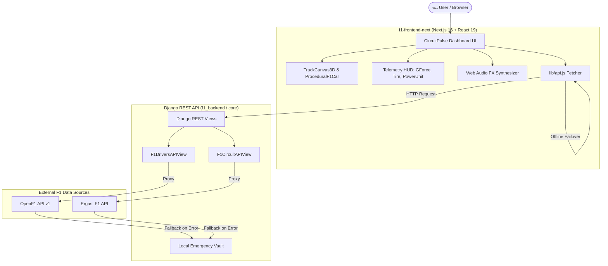

# 🏎️ CircuitPulse — Formula 1 Telemetry & 3D Analytics Platform

[](https://nextjs.org/)
[](https://react.dev/)
[](https://threejs.org/)
[](https://www.djangoproject.com/)
[](https://www.django-rest-framework.org/)
[](https://tailwindcss.com/)

> **CircuitPulse** is a high-performance, real-time Formula 1 telemetry visualizer, 3D circuit simulation engine, and race analytics workspace built with Next.js 16, React Three Fiber, Framer Motion, and a Django REST Framework backend.

---

## 🌟 Highlights & Key Features

### 🎮 1. 3D Interactive Circuit Canvas & Procedural F1 Car
* **Procedural 3D Track Scene**: Rendered via React Three Fiber (`@react-three/fiber`), `@react-three/drei`, and `@react-three/postprocessing` (bloom, depth of field).
* **Multi-Camera Perspective Engine**: Switch seamlessly between **Driver POV**, **Chase Cam**, **Drone View**, and **Cinematic Flyover**.
* **Procedural F1 Car Model**: Dynamic 3D car geometry featuring glowing brake discs, sidepods, front/rear wings, DRS wing actuation, and particle trail FX.
* **Interactive Circuit Selectors**: Explore iconic tracks including **Zandvoort**, **Monaco**, **Silverstone**, **Spa-Francorchamps**, **Monza**, **Suzuka**, and **Las Vegas**.

### 📊 2. Real-Time Telemetry HUD & Analytics Suite
* **Telemetry Graph Stream**: Real-time velocity ($km/h$ or $mph$), throttle position (%), brake force (%), engine RPM, gear selection, and DRS status tracking.
* **G-Force Vector Meter**: Interactive 2D/3D g-force ballistics display with dynamic lateral/longitudinal acceleration history trail.
* **Tire Thermal HUD**: 4-wheel telemetry tracking surface and carcass temperatures ($^\circ\text{C}$ / $^\circ\text{F}$) across Soft, Medium, Hard, Intermediate, and Wet compounds with degradation indicator.
* **Power Unit & ERS HUD**: Real-time hybrid powertrain state showing ICE power output ($hp$), MGU-K / MGU-H harvesting, battery State of Charge ($\text{SoC}\%$), and turbo boost pressure.

### 🚦 3. Paddock Experience & Reaction Time Simulator
* **CircuitPulse Reaction Tester**: High-precision reaction time mini-game simulating the 5-red-light starting sequence with millisecond accuracy logging.
* **Web Audio Synthesizer**: Custom synthesized audio engine (`audioFx.js`) delivering dynamic V10/V6 Turbo Hybrid engine sound FX, telemetry pings, radio static, DRS actuation, and UI feedback.
* **Driver Head-to-Head Comparison**: Compare driver sector times (S1, S2, S3), top speeds, pitstop strategies, points standings, and telemetry metrics side-by-side (`DriverCompareModal`).
* **Circuit Specifications Modal**: In-depth technical breakdown of lap records, track length, turn counts, DRS activation zones, elevation delta, and cornering gear strategies.

### 🛡️ 4. Resilient Multi-Layer API & Offline Fallback Architecture
* **OpenF1 & Ergast Integration**: Live proxying of F1 session drivers and circuit geometries.
* **Paddock Emergency Vault**: Multi-tiered fallback architecture. If external APIs experience rate-limiting, auth errors (401/403), or network dropouts, both the Django backend and Next.js frontend seamlessly pivot to local cached asset packages without degrading user experience.

---

## 🏗️ System Architecture



---

## 🛠️ Tech Stack

### **Frontend (`f1-frontend-next`)**
* **Framework**: [Next.js 16](https://nextjs.org/) (App Router) + [React 19](https://react.dev/)
* **3D Graphics & Animation**: [Three.js](https://threejs.org/), [@react-three/fiber](https://r3f.docs.pmnd.rs/), [@react-three/drei](https://github.com/pmndrs/drei), [@react-three/postprocessing](https://github.com/pmndrs/react-postprocessing), [Framer Motion](https://www.framer.com/motion/)
* **Styling**: [Tailwind CSS v4](https://tailwindcss.com/), Lucide Icons
* **Audio**: Native Web Audio API Synthesizer Engine

### **Backend (`f1_backend` & `core`)**
* **Framework**: [Django 6.0](https://www.djangoproject.com/)
* **API Engine**: [Django REST Framework](https://www.django-rest-framework.org/)
* **Middleware**: `django-cors-headers`
* **HTTP Client**: `requests`
* **Database**: SQLite 3

---

## 🚀 Quick Start Guide

### Prerequisites
* **Node.js**: `v18+` (v20+ recommended)
* **Python**: `v3.10+`
* **npm** or **pnpm** or **yarn**

---

### 1️⃣ Setting Up the Backend (Django API)

1. **Navigate to the backend directory**:
   ```bash
   cd F1_Project
   ```

2. **Create & activate a Virtual Environment** *(optional if existing venv is available)*:
   ```bash
   # Windows (PowerShell)
   python -m venv venv
   .\venv\Scripts\Activate.ps1

   # Linux / macOS
   python3 -m venv venv
   source venv/bin/activate
   ```

3. **Install Dependencies**:
   ```bash
   pip install django djangorestframework django-cors-headers requests
   ```

4. **Run Database Migrations**:
   ```bash
   python manage.py migrate
   ```

5. **Start the Django Development Server**:
   ```bash
   python manage.py runserver 8000
   ```
   > 🌐 Backend API will be available at: `http://127.0.0.1:8000/`

---

### 2️⃣ Setting Up the Frontend (Next.js)

1. **Open a new terminal and navigate to the frontend folder**:
   ```bash
   cd F1_Project/f1-frontend-next
   ```

2. **Install Dependencies**:
   ```bash
   npm install
   ```

3. **Start the Next.js Development Server**:
   ```bash
   npm run dev
   ```

4. **Open in Browser**:
   Navigate to [http://localhost:3000](http://localhost:3000) to view the CircuitPulse dashboard.

---

## 🔌 API Endpoints Reference

The Django backend exposes RESTful endpoints with automatic fallback payloads:

| Endpoint | Method | Description | Fallback Behavior |
| :--- | :--- | :--- | :--- |
| `/api/drivers/?session_key=<key>` | `GET` | Retrieves driver info, headshots, team colors & acronyms from OpenF1 | Serves telemetry package for top grid drivers if API is throttled/down |
| `/api/circuit/?circuit_id=<id>` | `GET` | Retrieves circuit metadata, locality, and SVG spatial layout vectors from Ergast | Serves hardcoded spatial shape vectors (e.g. Monaco, Silverstone) |

---

## 📁 Repository Structure

```
F1_Project/
├── db.sqlite3                       # SQLite Database
├── manage.py                        # Django Management Script
├── F1_Project/                      # Main Source Root
│   ├── core/                        # Django Application App
│   │   ├── admin.py
│   │   ├── apps.py
│   │   ├── models.py
│   │   ├── urls.py                  # API endpoints definition
│   │   └── views.py                 # F1DriversAPIView & F1CircuitAPIView
│   ├── f1_backend/                  # Django Project Settings
│   │   ├── settings.py              # CORS & Installed Apps config
│   │   ├── urls.py
│   │   └── wsgi.py
│   └── f1-frontend-next/            # Next.js 16 Web Application
│       ├── app/
│       │   ├── globals.css          # Custom styling & Tailwind configuration
│       │   ├── layout.js            # App layout & meta tags
│       │   └── page.js              # Primary CircuitPulse Dashboard page
│       ├── components/              # UI & 3D Components
│       │   ├── CinematicTrackScene.jsx
│       │   ├── CircuitPulseHero.jsx
│       │   ├── CircuitPulseNavbar.jsx
│       │   ├── CircuitSpecsModal.jsx
│       │   ├── DriverCompareModal.jsx
│       │   ├── GForceMeter.jsx
│       │   ├── PowerUnitGauge.jsx
│       │   ├── ScrollCircuitApproach.jsx
│       │   ├── TelemetryGraph.jsx
│       │   ├── TireThermalHUD.jsx
│       │   └── TrackCanvas3D.jsx
│       ├── lib/                     # Data Stores & Web Audio Engine
│       │   ├── api.js               # Django API client & Circuit dataset
│       │   ├── audioFx.js           # Web Audio API Synthesizer
│       │   ├── raceCalendar.js      # F1 Grand Prix calendar data
│       │   └── telemetryData.js     # Live telemetry mock stream generators
│       └── package.json
└── README.md                        # Documentation
```

---

## 🤝 Contributing

Contributions, bug reports, and feature suggestions are always welcome!
1. Fork the project repository.
2. Create your Feature Branch (`git checkout -b feature/AmazingFeature`).
3. Commit your changes (`git commit -m 'feat: Add some AmazingFeature'`).
4. Push to the Branch (`git push origin feature/AmazingFeature`).
5. Open a Pull Request.

---

## 📄 License

Distributed under the MIT License. See `LICENSE` for more details.
